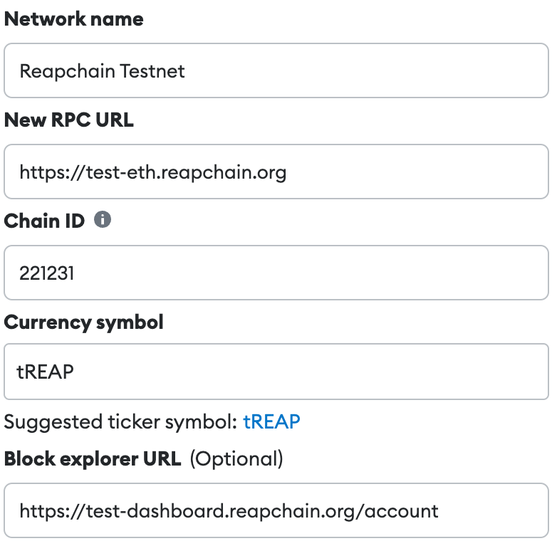

# Connect Wallet

Use the "Connect Wallet" menu on the top right to connect with Keplr or Metamask.

.png>)

### Connect With Keplr

1. Click the "With Keplr" button to connect with the Cosmos-based Keplr wallet.
2. Approve the "Chain Add Request"\
   .png>)
3. Approve the "Requesting Connection"\
   .png>)
4. If the connection is successful, the button will show the Bech32 account address and account name in Keplr.\
   .png>)

### Connect With Metamask

1. Click the "With Metamask" button to connect with the Ethereum-based Metamask wallet.
2. Sign to get public key.\
   .png>)
3. If the connection is successful, the button will show the HEX account address.\
   

